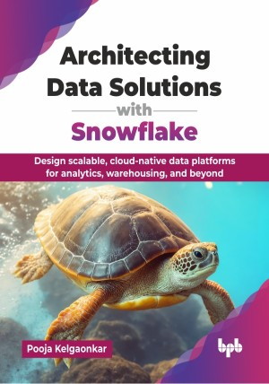

# Architecting Data Solutions with Snowflake

Design scalable, cloud-native data platforms for analytics, warehousing, and beyond.

This is the repository for [Architecting Data Solutions with Snowflake
](https://bpbonline.com/products/architecting-data-solutions-with-snowflake?variant=44728058216648),published by BPB Publications.

## About the Book
Modern businesses need scalable, cost-efficient data platforms; however, traditional, fragmented systems are complex and expensive. Snowflake provides a modern, cloud-native, fully managed solution, simplifying data architecture while delivering performance and flexibility. This book helps readers leverage Snowflake's full potential for advanced, scalable data solutions.

This book begins by walking you through Snowflake account configuration and its unique three-layered architecture, introducing key architectural pillars. The book covers building data engineering pipelines using various methods like Snowpipe and Snowpark, differentiating between ETL and ELT patterns. Finally, you will learn to architect diverse data patterns, such as data warehouses, data lakes, data mesh, and lakehouses, and explore Snowpark for machine learning, Snowflake Horizon, Cortex, and building generative AI and LLM solutions.

This book equips you with the knowledge to design and implement modern data solutions, including data warehouses, lakes, and mesh patterns, using Snowflake. You will be well-equipped to tackle complex data architecture challenges and drive innovation in any data-driven environment.

## What You Will Learn
• Learn to design data platform solutions with Snowflake.

• Design scalable and cost-effective data architectures.

• Implement efficient data ingestion and extraction pipelines.

• Implement modern data patterns, including data warehouse, data lake, and data mesh, using Snowflake’s flexible architecture.

• Apply modern data governance and security practices.

• Design AI/ML workloads using Snowflake Cortex.
